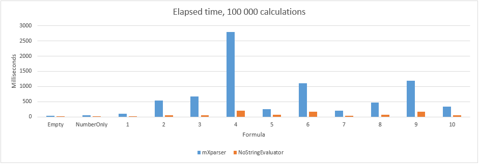
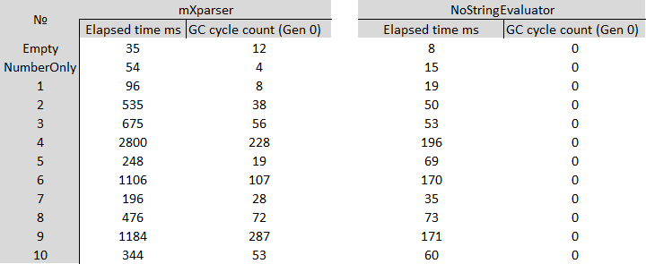
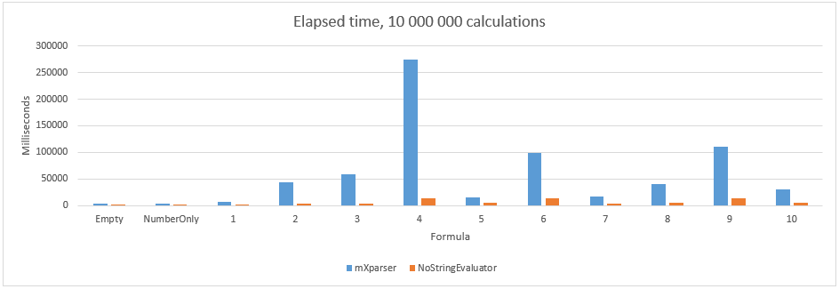
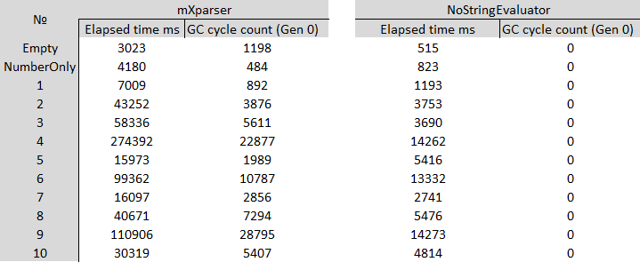
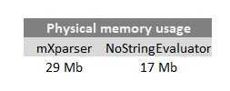

# NoStringEvaluating
Fast and easy mathematical evaluation without endless string parsing! Parses string formula once and uses its object sequence in each evaluation. Moreover, provides user defined functions and variables.

[](https://travis-ci.org/KovtunV/NoStringEvaluating)
[](https://www.nuget.org/packages/NoStringEvaluating)
[](https://www.nuget.org/packages/NoStringEvaluating)

------------
<!--ts-->

   * [Features](#Features)
   * [Performance](#Performance)
      * [Testing machine](#Testing-machine)
      * [Testing formulas](#Testing-formulas)
      * [100 000 calculations](#100-000-calculations)
      * [10 000 000 calculations](#10-000-000-calculations)
      * [Memory usage](#Memory-usage)
      * [Conclusion](#Conclusion)
   * [Quick start](#Quick-start)
      * [Initializing](#Initializing)
      * [Usage](#Usage)
   * [Variables](#Variables)
      * [Simple variable](#Simple-variable)
      * [Bordered variable](#Bordered-variable)
      * [Precompiled variables](#Precompiled-variables)
   * [Operators](#Operators)
   * [Boolean operators](#Boolean-operators)
   * [Functions](#Functions)
      * [Math](#Math)
      * [Trigonometry](#Trigonometry)
      * [Logic](#Logic)
   * [Options](#Options)
   * [Documentation](#Documentation)
      * [IFormulaParser](#IFormulaParser)
      * [IFunctionReader](#IFunctionReader)
      * [IFormulaCache](#IFormulaCache)
      * [IFormulaChecker](#IFormulaChecker)
      * [INoStringEvaluator](#INoStringEvaluator)
   * [TODO](#TODO)

<!--te-->

------------

## Features

- Fast math evaluation;
- Zero-allocation code (object pooling);
- User defined functions;
- User defined variables with any chars.

## Performance
Compared with a good solution [mXparser](https://github.com/mariuszgromada/MathParser.org-mXparser "mXparser")

- In general, **x6** faster!

### Testing machine
- Laptop
- CPU i7-4710HQ without turbo boost, with fixed 2.5 GHz
- RAM DDR3 1600 MHz

### Testing formulas
|  № | Formula |
| ------------ | ------------ |
| Empty  |   |
|  NumberOnly | 3 |
| 1 |  3 \* 9 |
| 2 | 3 \* 9 / 456 \* 32 + 12 / 17 - 3 |
| 3 | 3 \* (9 / 456 \* (32 + 12)) / 17 - 3  |
| 4 | (2 + 6 - (13 \* 24 + 5 / (123 - 364 + 23))) - (2 + 6 - (13 \* 24 + 5 / (123 - 364 + 23))) + (2 + 6 - (13 \* 24 + 5 / (123 - 364 + 23))) \* 345 \* ((897 - 323)/ 23)  |
| 5 | [Arg1] \* [Arg2] + [Arg3] - [Arg4] |
| 6 | [Arg1] \* ([Arg2] + [Arg3]) - [Arg4] / ([Arg5] - [Arg6]) + 45 \* [Arg7] + (([Arg8] \* 56 + (12 + [Arg9]))) - [Arg10] |
| 7 | add(1; 2; 3) |
| 8 | add(add(5; 1) - add(5; 2; 3)) |
| 9 | if([Arg1]; add(56 + 9 / 12 \* 123.596; or(78; 9; 5; 2; 4; 5; 8; 7); 45;5); 9) \*     24 + 52 -33 |
| 10 | kov(1; 2; 3) - kovt(8; 9)  |

It used to write variables with brackets, but now you can write them without brackets. See more in [Variables](#Variables).

### 100 000 calculations

Less is better.





### 10 000 000 calculations

Less is better.




### Memory usage



### Conclusion
In formulas with variables I update all variables before each evaluation. As you can see, this solution faster in all cases and it doesn't matter how many calculations you have 100 000 or 10 000 000.

Benchmark code you can find in **ConsoleApp.Benchmark**.

Benchmark excel sheet you can find here - **Benchmark.xlsx**.

## Quick start
### Initializing
Basically, this solution has developed for web api projects, so you should add implementations in Startup.cs:
```csharp
public void ConfigureServices(IServiceCollection services)
{
    // ......
    services.AddNoStringEvaluator();
}
```

### Usage
Add **INoStringEvaluator** to your controller, service, etc..
And just send **string** or **FormulaNodes** to evaluation:
```csharp
public class MyService
{
    private INoStringEvaluator _noStringEvaluator;
    public MyService(INoStringEvaluator noStringEvaluator)
    {
        _noStringEvaluator = noStringEvaluator;
    }

    public double Calc(string formula)
    {
        return _noStringEvaluator.Calc(formula);
    }
}
```
If you have variables, you can send **IDictionary** or your **IVariablesContainer** implementation:
```csharp
public class MyService
{
    private INoStringEvaluator _noStringEvaluator;

    public MyService(INoStringEvaluator noStringEvaluator)
    {
        _noStringEvaluator = noStringEvaluator;
    }

    public double Calc(string formula, IDictionary<string, double> variables)
    {
        return _noStringEvaluator.Calc(formula, variables);
    }
}
```

If you have custom functions, you shoud use **IFunctionReader** in startup:
```csharp
public void Configure(IApplicationBuilder app, IWebHostEnvironment env)
{
    // ...
    var functionReader = app.ApplicationServices.GetRequiredService<IFunctionReader>();
    functionReader.AddFunction(new Func_kov());

    // If you don't want to write the each function directly, use this:
    // Just send type where you have functions
    // NoStringFunctionsInitializer.InitializeFunctions(functionReader, typeof(Startup));
}
```

## Variables

You can use two types of variables:
- Simple variable
- Bordered variable

### Simple variable

Simple variable means that it named without unique symbols and starts with a letter. Only one extra symbol is possible, it's "_"

Some examples:
- "25 + myArgument - 1"
- "25 + myArg1 - 2"
- "arg5684argArg_arg"
- "25 + myArgument_newAge - 3"

### Bordered variable

Bordered variable means that it has a difficult name with any symbols, except for square brackets.

Some examples:
- "25 + [myVariable and some words] - 1"
- "25 + [Provider("my provider").Month(1).Price] - 2"
- "[myVariable ♥]"
- "[simpleVariable]"

Needless to say, you can write simple variable with brackets too.

### Precompiled variables

There are some known variables, you shouldn't send them to Calc method.

| Key word  |  Description | Value  |
| ------------ | ------------ | ------------ |
| pi | Pi, Archimedes' constant or Ludolph's number  | 3.14159265358979323846 |
| tau | A circle constant equal to 2π | 6.283185307179586476925  |
| e |  Napier's constant, or Euler's number, base of Natural logarithm |  2.7182818284590452354 |
| true | Boolean True represented as double  | 1 |
| false | Boolean False represented as double  | 0 |

These variables are register independent, you can write Pi, [PI], pI, True, etc...

## Operators

| Key word  |  Description | Example  |
| ------------ | ------------ | ------------ |
| +  | Addition  | a + b  |
|  - |  Subtraction |  a - b |
|  \* | Multiplication  | a \* b  |
|  / | Division  |  a / b |
| ^|  Exponentiation |  a^b |

## Boolean operators

| Key word  |  Description | Example  |
| ------------ | ------------ | ------------ |
| <  | Lower than | a < b  |
| <=  | Lower or equal| a <= b  |
| >  | Greater than | a > b  |
| >=  | Greater or equal | a >= b  |
| ==  | Equality | a == b  |
| !=  | Inequation | a != b  |
| &&  | Logical conjunction (AND)  | a && b  |
| \|\|  | Logical disjunction (OR)  | a \|\| b  |

## Functions

### Math
| Key word  |  Description | Example  |
| ------------ | ------------ | ------------ |
| add  | Summation operator  | add(a1; a2; ...; an)  |
| multi | Multiplication | multi(a1; a2; ...; an) |
| mean |  Mean / average value | mean(a1; a2; ...; an) |
| min | Minimum function | min(a; b) |
| max | Maximum function | max(a; b) |
| ln | Natural logarithm function (base e) | ln(x) |
| log | Logarithm function (base b) | log(a; b) |
| log2 | Binary logarithm function (base 2) | log2(x) |
| log10 | Common logarithm function (base 10) | log10(x) |
| sqrt | Squre root function | sqrt(x) |
| abs | Absolut value function| abs(x) |
| sgn | Signum function| sgn(x) |
| sign | Signum function| sign(x) |
| floor | Floor function| floor(x) |
| ceil | Ceiling function| ceil(x) |
| mod | Modulo function | mod(a; b) |
| fact | Factorial function | fact(x) |
| fib | Fibonacci number | fib(x) |
| gcd | Greatest common divisor | gcd(a1; a2; ...; an) |
| lcm | Least common multiple | lcm(a1; a2; ...; an) |

### Trigonometry
| Key word  |  Description | Example  |
| ------------ | ------------ | ------------ |
| sin | Trigonometric sine function | sin(x) |
| cos | Trigonometric cosine function | cos(x) |
| tg | Trigonometric tangent function | tg(x) |
| tan | Trigonometric tangent function | tan(x) |
| ctg | Trigonometric cotangent function | ctg(x) |
| cot | Trigonometric cotangent function | cot(x) |
| ctan | Trigonometric cotangent function | ctan(x) |
| sec | Trigonometric secant function | sec(x) |
| csc | Trigonometric cosecant function | csc(x) |
| cosec | Trigonometric cosecant function | cosec(x) |
| asin | Inverse trigonometric sine function | asin(x) |
| arsin | Inverse trigonometric sine function | arsin(x) |
| arcsin | Inverse trigonometric sine function | arcsin(x) |
| acos | Inverse trigonometric cosine function | acos(x) |
| arcos | Inverse trigonometric cosine function | arcos(x) |
| arccos | Inverse trigonometric cosine function | arccos(x) |
| atg | Inverse trigonometric tangent function| atg(x) |
| atan | Inverse trigonometric tangent function| atan(x) |
| arctg | Inverse trigonometric tangent function| arctg(x) |
| arctan | Inverse trigonometric tangent function| arctan(x) |
| actg | Inverse trigonometric cotangent function| actg(x) |
| acot | Inverse trigonometric cotangent function| acot(x) |
| actan | Inverse trigonometric cotangent function| actan(x) |
| arcctg | Inverse trigonometric cotangent function| arcctg(x) |
| arccot | Inverse trigonometric cotangent function| arccot(x) |
| arcctan | Inverse trigonometric cotangent function| arcctan(x) |
| sinh | Hyperbolic sine function | sinh(x) |
| cosh | Hyperbolic cosine function | cosh(x) |
| tgh | Hyperbolic tangent function | tgh(x) |
| tanh | Hyperbolic tangent function | tanh(x) |
| coth | Hyperbolic cotangent function | coth(x) |
| ctgh | Hyperbolic cotangent function | ctgh(x) |
| ctanh | Hyperbolic cotangent function | ctanh(x) |
| sech | Hyperbolic secant function| sech(x) |
| csch | Hyperbolic cosecant function| csch(x) |
| cosech | Hyperbolic cosecant function| cosech(x) |
| arcsec |Inverse trigonometric secant | arcsec(x) |
| asinh | Inverse hyperbolic sine function | asinh(x) |
| arsinh | Inverse hyperbolic sine function | arsinh(x) |
| arcsinh | Inverse hyperbolic sine function | arcsinh(x) |
| acosh | Inverse hyperbolic cosine function | acosh(x) |
| arcosh | Inverse hyperbolic cosine function | arcosh(x) |
| arccosh | Inverse hyperbolic cosine function | arccosh(x) |
| atgh | Inverse hyperbolic tangent function| atgh(x) |
| atanh | Inverse hyperbolic tangent function| atanh(x) |
| arctgh | Inverse hyperbolic tangent function| arctgh(x) |
| arctanh | Inverse hyperbolic tangent function| arctanh(x) |
| acoth | Inverse hyperbolic cotangent function| acoth(x) |
| actgh | Inverse hyperbolic cotangent function| actgh(x) |
| actanh | Inverse hyperbolic cotangent function| actanh(x) |
| arccoth | Inverse hyperbolic cotangent function| arccoth(x) |
| arcctgh | Inverse hyperbolic cotangent function| arcctgh(x) |
| arcctanh | Inverse hyperbolic cotangent function| arcctanh(x) |
| asech |  Inverse hyperbolic secant function  | asech(x) |
| arsech |  Inverse hyperbolic secant function  | arsech(x) |
| arcsech |  Inverse hyperbolic secant function  | arcsech(x) |
| acsch |  Inverse hyperbolic cosecant function  | acsch(x) |
| arcsch |  Inverse hyperbolic cosecant function  | arcsch(x) |
| arccsch |  Inverse hyperbolic cosecant function  | arccsch(x) |
| acosech |  Inverse hyperbolic cosecant function  | acosech(x) |
| arcosech |  Inverse hyperbolic cosecant function  | arcosech(x) |
| rad | Degrees to radians function | rad(x) |
| deg | Radians to degrees function| deg(x) |
| exp | Exponential function | exp(x) |

### Logic
| Key word  |  Description | Example  |
| ------------ | ------------ | ------------ |
| if | If function  | if(cond; expr-if-true; expr-if-false) |
| iff | If function  | iff( cond-1; expr-1; ... ; cond-n; expr-n ) |
| and | Logical conjunction (AND)  |   and(a1; a2; ...; an) |
| or | Logical disjunction (OR) |  or(a1; a2; ...; an) |
| not | Negation function |  not(x) |
| isNaN | Returns true = 1 if value is a Not-a-Number (NaN), false = 0 otherwise |  isNaN(x) |

## Options
When you use **AddNoStringEvaluator** in **startup.cs** you can configure evaluator.

There are two options:

- FloatingTolerance (default is 0.0001)
- FloatingPointSymbol (default is FloatingPointSymbol.Dot)

To illustrate, I change floating point from default **dot** to **comma**:

```csharp
public void ConfigureServices(IServiceCollection services)
{
    // ......
    services.AddNoStringEvaluator(opt => opt.FloatingPointSymbol = FloatingPointSymbol.Comma);
}
```

## Documentation
Solution contains five following services:
- IFormulaParser
- IFunctionReader
- IFormulaCache
- IFormulaChecker
- INoStringEvaluator

One optional interface, you can implement if IDictionary is inconvenient.
- IVariablesContainer

Furthermore, two object pools:
- `ObjectPool.Create<Stack<double>>`
- `ObjectPool.Create<List<double>>`

### IFormulaParser
Performs two functions:
- Parsing from char collection to object sequence
- Reversing sequeance as **Reverse Polish notation**

Contains two methods:
- `FormulaNodes Parse(string formula)`
- `FormulaNodes Parse(ReadOnlySpan<char> formula)`

### IFunctionReader
Performs using user defined functions.

Contains three methods:
- `void AddFunction(IFunction func, bool replace = false)`
- `void RemoveFunction(string functionName)`
- `bool TryProceedFunction(List<IFormulaNode> nodes, ReadOnlySpan<char> formula, ref int index)`

### IFormulaCache
Performs formula caching. It is used by default **INoStringEvaluator** implementation. It uses **IFormulaParser** which parses string formula to object sequence.

Contains one method:
- `FormulaNodes GetFormulaNodes(string formula)`

### IFormulaChecker
Performs syntax checking.

Contains two methods:
- `CheckFormulaResult CheckSyntax(string formula)`
- `CheckFormulaResult CheckSyntax(ReadOnlySpan<char> formula)`

### INoStringEvaluator
Performs evaluating :relaxed:

Contains six methods:
- `double Calc(string formula, IVariablesContainer variables)`
- `double Calc(FormulaNodes formulaNodes, IVariablesContainer variables)`
- `double Calc(string formula, IDictionary<string, double> variables)`
- `double Calc(FormulaNodes formulaNodes, IDictionary<string, double> variables)`
- `double Calc(string formula)`
- `double Calc(FormulaNodes formulaNodes)`

## TODO
- Any idea?