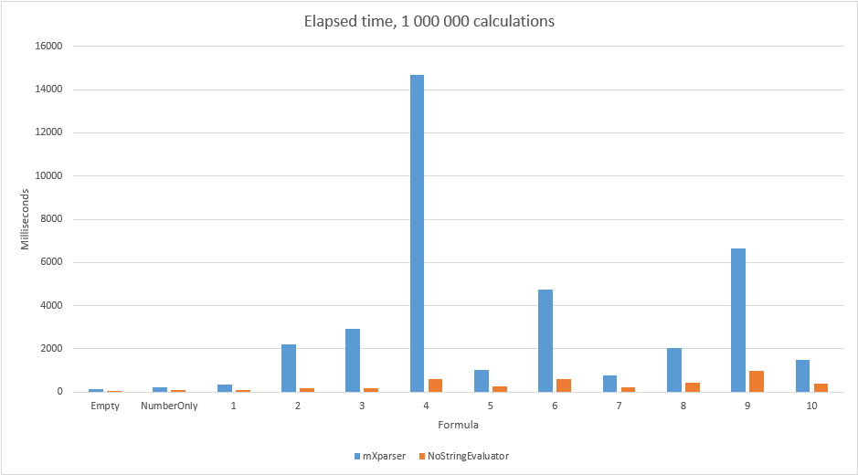
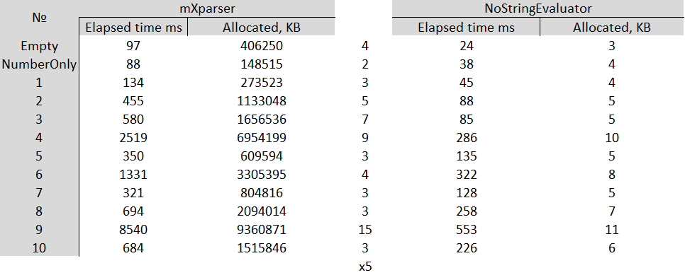
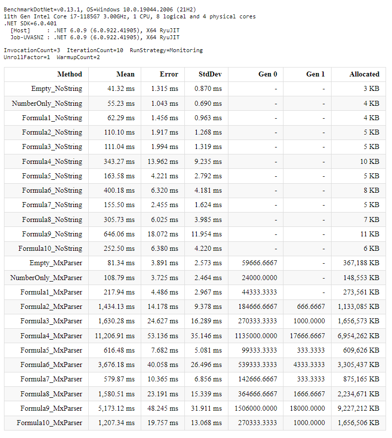

Fast low memory consuming mathematical evaluation without endless string parsing! Parses string formula once and uses its object sequence in each evaluation. Moreover provides user defined functions and variables. <br/>
[](https://travis-ci.com/github/KovtunV/NoStringEvaluating) [](https://www.nuget.org/packages/NoStringEvaluating) [](https://www.nuget.org/packages/NoStringEvaluating) [](https://twitter.com/intent/tweet?text=Good%20expression%20evaluator,%20take%20a%20look!&url=https://github.com/KovtunV/NoStringEvaluating&hashtags=expression,evaluator,math,formula)
<br/>

Microsoft.Extensions.DependencyInjection <br/>
[](https://travis-ci.com/github/KovtunV/NoStringEvaluating) [](https://www.nuget.org/packages/NoStringEvaluating.Extensions.Microsoft.DependencyInjection) [](https://www.nuget.org/packages/NoStringEvaluating.Extensions.Microsoft.DependencyInjection)
<br/>

## Quick Links
<!--ts-->
   * [Features](#Features)
   * [Performance](#Performance)
      * [Testing formulas](#Testing-formulas)
      * [1 000 000 calculations](#1-000-000-calculations)
      * [Benchmark results](#Benchmark-results)
      * [Conclusion](#Conclusion)
   * [Quick start](#Quick-start)
      * [Initialization](#Initialization)
      * [Usage](#Usage)
      * [User defined functions](#User-defined-functions)
   * [Extra types](#Extra-types)
      * [List description](#List-description)
   * [Variables](#Variables)
      * [Simple variable](#Simple-variable)
      * [Bordered variable](#Bordered-variable)
      * [Precompiled variables](#Precompiled-variables)
   * [Operators](#Operators)
   * [Boolean operators](#Boolean-operators)
   * [Functions](#Functions)
      * [Math](#Math)
      * [Trigonometry](#Trigonometry)
      * [Logic](#Logic)
      * [Excel](#Excel)
          * [DateTime](#DateTime)
          * [Word](#Word)
      * [Null](#Null)
   * [Options](#Options)
   * [Documentation](#Documentation)
      * [IFormulaParser](#IFormulaParser)
      * [IFunctionReader](#IFunctionReader)
      * [IFormulaCache](#IFormulaCache)
      * [IFormulaChecker](#IFormulaChecker)
      * [IVariablesContainer](#IVariablesContainer)
      * [IFunction](#IFunction)
      * [NoStringEvaluatorOptions](#NoStringEvaluatorOptions)
      * [INoStringEvaluator](#INoStringEvaluator)
      * [INoStringEvaluatorNullable](#INoStringEvaluatorNullable)
      * [NoStringEvaluator](#NoStringEvaluator)
      * [NoStringEvaluatorNullable](#NoStringEvaluatorNullable)
   * [Thanks for contribution :octocat:](#Thanks-for-contribution)
   * [TODO](#TODO)
<!--te-->

------------

## Features
- Fast math evaluation
- Zero-allocation code (object pooling)
- User defined functions
- User defined variables with any chars
- Mixed result type

## Performance
Compared with a good solution [mXparser](https://github.com/mariuszgromada/MathParser.org-mXparser "mXparser")

- In general, **x8** faster!

### Testing formulas
|  № | Formula |
| ------------ | ------------ |
| Empty  |   |
|  NumberOnly | 3 |
| 1 |  3 \* 9 |
| 2 | 3 \* 9 / 456 \* 32 + 12 / 17 - 3 |
| 3 | 3 \* (9 / 456 \* (32 + 12)) / 17 - 3  |
| 4 | (2 + 6 - (13 \* 24 + 5 / (123 - 364 + 23))) - (2 + 6 - (13 \* 24 + 5 / (123 - 364 + 23))) + (2 + 6 - (13 \* 24 + 5 / (123 - 364 + 23))) \* 345 \* ((897 - 323)/ 23)  |
| 5 | Arg1 \* Arg2 + Arg3 - Arg4 |
| 6 | Arg1 \* (Arg2 + Arg3) - Arg4 / (Arg5 - Arg6) + 45 \* Arg7 + ((Arg8 \* 56 + (12 + Arg9))) - Arg10 |
| 7 | add(1; 2; 3) |
| 8 | add(add(5; 1) - add(5; 2; 3)) |
| 9 | if(Arg1; add(56 + 9 / 12 \* 123.596; or(78; 9; 5; 2; 4; 5; 8; 7); 45;5); 9) \*     24 + 52 -33 |
| 10 | kov(1; 2; 3) - kovt(8; 9)  |

### 1 000 000 calculations
Less is better



### Benchmark results


### Conclusion
As you can see this solution is faster in all cases, furthermore there isn't any garbage collection.

Benchmark code - [ConsoleApp/Benchmark/BenchmarkNumberService.cs](ConsoleApp/Benchmark/BenchmarkNumberService.cs "ConsoleApp/Benchmark/BenchmarkNumberService.cs")

Benchmark excel - [BenchResults/Benchmark.xlsx](BenchResults/Benchmark.xlsx "BenchResults/Benchmark.xlsx")

## Quick start
### Initialization
There are two ways to use evaluator:
1. Static initialization
```csharp
public void SomeMethod()
{
    var facade = NoStringEvaluator.CreateFacade();
    var evaluator = facade.Evaluator;
}
```
2. DI from the [package](https://www.nuget.org/packages/NoStringEvaluating.Extensions.Microsoft.DependencyInjection "package")
```csharp
public void ConfigureServices(IServiceCollection services)
{
    // ......
    services.AddNoStringEvaluator();
}
```

### Usage
Add **INoStringEvaluator** to your controller, service, etc...

And just send **string** or **FormulaNodes** to evaluation:
```csharp
public class MyService
{
    private INoStringEvaluator _noStringEvaluator;
    public MyService(INoStringEvaluator noStringEvaluator)
    {
        _noStringEvaluator = noStringEvaluator;
    }

    public double CalcNumber(string formula)
    {
        return _noStringEvaluator.CalcNumber(formula);
    }
    
    public string CalcWord(string formula)
    {
        return _noStringEvaluator.CalcWord(formula);
    }
    
    public EvaluatorValue Calc(string formula)
    {
        return _noStringEvaluator.Calc(formula);
    }
}
```
If you have variables, you can send **IDictionary** or your **IVariablesContainer** implementation:
```csharp
public class MyService
{
    private INoStringEvaluator _noStringEvaluator;

    public MyService(INoStringEvaluator noStringEvaluator)
    {
        _noStringEvaluator = noStringEvaluator;
    }

    public double Calc(string formula, IDictionary<string, EvaluatorValue> variables)
    {
        return _noStringEvaluator.CalcNumber(formula, variables);
    }
}
```

### User defined functions
If you need your function, just implement the interface **IFunction**
If you want to returnt extra type, use factory.

For instance, usage function "YouAre('Vitaly'; 26)":
```csharp
public class MyFunction : IFunction
{
    public string Name { get; } = "YouAre";

    bool CanHandleNullArguments { get; }

    public InternalEvaluatorValue Execute(List<InternalEvaluatorValue> args, ValueFactory factory)
    {
        var name = args[0].GetWord();
        var age = args[1];

        var ageAfterDecade = age + 10;
        var result = $"Hello, {name}. After 10 years you will be {ageAfterDecade} y.o.";

        return factory.Word.Create(result);
    }
}
```

And don't forget to initialize your functions via options or directly in `IFunctionReader`
```csharp
public void SomeMethod()
{
    // NoStringEvaluator.CreateFacade(opt => opt.WithFunctionsFrom(<type from source assembly>));
    // NoStringEvaluator.CreateFacade(opt => opt.WithFunctionsFrom(<source assembly>));
    // NoStringEvaluator.CreateFacade(opt => opt.WithFunctions(new MyFunction()));

    // same with CI
    // services.AddNoStringEvaluator(opt =>  opt.WithFunctions(new MyFunction()));
}
```

## Extra types
Apart from double calculations you can work with types:
- Boolean
- DateTime
- String
- List of string
- List of double
- Null
- Object

Object is a special type to allow using, for example, services inside function.
```csharp
public void Should_Evaluate_Service()
{
    // arrange
    var service = _serviceFactory(null);
    var args = new Dictionary<string, EvaluatorValue>
    {
        ["myService"] = new EvaluatorValue(new MyService()),
        ["myNum"] = 10
    };
    var expected = 50.5;

    // act
    var actual = service.CalcNumber("TestService(myService; myNum)", args);

    // assert
    actual.Should().BeApproximatelyNumber(expected);
}

private class ServiceFunction : IFunction
{
    public string Name { get; } = "TestService";

    public bool CanHandleNullArguments { get; }

    public InternalEvaluatorValue Execute(List<InternalEvaluatorValue> args, ValueFactory factory)
    {
        return args[0].GetObject<MyService>().GetTemperature() + args[1];
    }
}

private class MyService
{
    public double GetTemperature()
    {
        return 40.5;
    }
}
```

### List description
You can describe a list inside the formula

| Example  |  Result |
| ------------ | ------------ |
| IsMember({'printer', 'computer', 'monitor'}; 'computer') | 1  |
| Unique({'NEW','OLD','NEW','HEAVEN','OLD'}) | {'NEW','OLD','HEAVEN'} |
| Add({1, 2, 3, 10, 3}) | 19 |

## Variables
You can use two types of variables:
- Simple variable
- Bordered variable

### Simple variable
Simple variable means that it named without unique symbols and starts with a letter. Only one extra symbol is possible, it's "_"

Some examples:
- "25 + myArgument - 1"
- "25 + myArg1 - 2"
- "arg5684argArg_arg"
- "25 + myArgument_newAge - 3"

### Bordered variable
Bordered variable means that it has a tricky name with any symbols, except for square brackets.

Some examples:
- "25 + [myVariable and some words] - 1"
- "25 + [Provider("my provider").Month(1).Price] - 2"
- "[myVariable ♥]"
- "[simpleVariable]"

Needless to say, you can write simple variable with brackets as well.

### Precompiled variables
There are some known variables, you shouldn't send them to Calc method.

| Key word  |  Description | Value  |
| ------------ | ------------ | ------------ |
| pi | Pi, Archimedes' constant or Ludolph's number  | 3.14159265358979323846 |
| tau | A circle constant equal to 2π | 6.283185307179586476925  |
| e |  Napier's constant, or Euler's number, base of Natural logarithm |  2.7182818284590452354 |
| true | Boolean True  | True |
| false | Boolean False  | False |
| ASC | Boolean True  | True |
| DESC | Boolean False | False |

These variables are register independent, you can write Pi, [PI], pI, True, etc...

## Operators
| Key word  |  Description | Example  |
| ------------ | ------------ | ------------ |
| +  | Addition | a + b  |
|  - |  Subtraction |  a - b |
|  \* | Multiplication  | a \* b  |
|  / | Division  |  a / b |
| ^|  Exponentiation |  a^b |

## Boolean operators
| Key word  |  Description | Example  |
| ------------ | ------------ | ------------ |
| <  | Lower than | a < b  |
| <=  | Lower or equal| a <= b  |
| >  | Greater than | a > b  |
| >=  | Greater or equal | a >= b  |
| ==  | Equality | a == b  |
| !=  | Inequation | a != b  |
| &&  | Logical conjunction (AND)  | a && b  |
| \|\|  | Logical disjunction (OR)  | a \|\| b  |

## Functions

### Math
| Key word  |  Description | Example  |
| ------------ | ------------ | ------------ |
| add  | Summation operator  | add(a1; a2; ...; an) can include List<double> |
| multi | Multiplication | multi(a1; a2; ...; an) can include List<double> |
| mean |  Mean / average value | mean(a1; a2; ...; an) can include List<double> |
| min | Minimum function | min(a; b) can include List<double> |
| max | Maximum function | max(a; b) can include List<double> |
| Rpund | Rounds the designated number to the specified decimals | Round(a; decimals) |
| ln | Natural logarithm function (base e) | ln(x) |
| log | Logarithm function (base b) | log(a; b) |
| log2 | Binary logarithm function (base 2) | log2(x) |
| log10 | Common logarithm function (base 10) | log10(x) |
| sqrt | Squre root function | sqrt(x) |
| abs | Absolut value function| abs(x) |
| sgn | Signum function| sgn(x) |
| sign | Signum function| sign(x) |
| floor | Floor function| floor(x) |
| ceil | Ceiling function| ceil(x) |
| mod | Modulo function | mod(a; b) |
| fact | Factorial function | fact(x) |
| fib | Fibonacci number | fib(x) |
| gcd | Greatest common divisor | gcd(a1; a2; ...; an) |
| lcm | Least common multiple | lcm(a1; a2; ...; an) |

### Trigonometry
| Key word  |  Description | Example  |
| ------------ | ------------ | ------------ |
| sin | Trigonometric sine function | sin(x) |
| cos | Trigonometric cosine function | cos(x) |
| tg | Trigonometric tangent function | tg(x) |
| tan | Trigonometric tangent function | tan(x) |
| ctg | Trigonometric cotangent function | ctg(x) |
| cot | Trigonometric cotangent function | cot(x) |
| ctan | Trigonometric cotangent function | ctan(x) |
| sec | Trigonometric secant function | sec(x) |
| csc | Trigonometric cosecant function | csc(x) |
| cosec | Trigonometric cosecant function | cosec(x) |
| asin | Inverse trigonometric sine function | asin(x) |
| arsin | Inverse trigonometric sine function | arsin(x) |
| arcsin | Inverse trigonometric sine function | arcsin(x) |
| acos | Inverse trigonometric cosine function | acos(x) |
| arcos | Inverse trigonometric cosine function | arcos(x) |
| arccos | Inverse trigonometric cosine function | arccos(x) |
| atg | Inverse trigonometric tangent function| atg(x) |
| atan | Inverse trigonometric tangent function| atan(x) |
| arctg | Inverse trigonometric tangent function| arctg(x) |
| arctan | Inverse trigonometric tangent function| arctan(x) |
| actg | Inverse trigonometric cotangent function| actg(x) |
| acot | Inverse trigonometric cotangent function| acot(x) |
| actan | Inverse trigonometric cotangent function| actan(x) |
| arcctg | Inverse trigonometric cotangent function| arcctg(x) |
| arccot | Inverse trigonometric cotangent function| arccot(x) |
| arcctan | Inverse trigonometric cotangent function| arcctan(x) |
| sinh | Hyperbolic sine function | sinh(x) |
| cosh | Hyperbolic cosine function | cosh(x) |
| tgh | Hyperbolic tangent function | tgh(x) |
| tanh | Hyperbolic tangent function | tanh(x) |
| coth | Hyperbolic cotangent function | coth(x) |
| ctgh | Hyperbolic cotangent function | ctgh(x) |
| ctanh | Hyperbolic cotangent function | ctanh(x) |
| sech | Hyperbolic secant function| sech(x) |
| csch | Hyperbolic cosecant function| csch(x) |
| cosech | Hyperbolic cosecant function| cosech(x) |
| arcsec |Inverse trigonometric secant | arcsec(x) |
| asinh | Inverse hyperbolic sine function | asinh(x) |
| arsinh | Inverse hyperbolic sine function | arsinh(x) |
| arcsinh | Inverse hyperbolic sine function | arcsinh(x) |
| acosh | Inverse hyperbolic cosine function | acosh(x) |
| arcosh | Inverse hyperbolic cosine function | arcosh(x) |
| arccosh | Inverse hyperbolic cosine function | arccosh(x) |
| atgh | Inverse hyperbolic tangent function| atgh(x) |
| atanh | Inverse hyperbolic tangent function| atanh(x) |
| arctgh | Inverse hyperbolic tangent function| arctgh(x) |
| arctanh | Inverse hyperbolic tangent function| arctanh(x) |
| acoth | Inverse hyperbolic cotangent function| acoth(x) |
| actgh | Inverse hyperbolic cotangent function| actgh(x) |
| actanh | Inverse hyperbolic cotangent function| actanh(x) |
| arccoth | Inverse hyperbolic cotangent function| arccoth(x) |
| arcctgh | Inverse hyperbolic cotangent function| arcctgh(x) |
| arcctanh | Inverse hyperbolic cotangent function| arcctanh(x) |
| asech |  Inverse hyperbolic secant function  | asech(x) |
| arsech |  Inverse hyperbolic secant function  | arsech(x) |
| arcsech |  Inverse hyperbolic secant function  | arcsech(x) |
| acsch |  Inverse hyperbolic cosecant function  | acsch(x) |
| arcsch |  Inverse hyperbolic cosecant function  | arcsch(x) |
| arccsch |  Inverse hyperbolic cosecant function  | arccsch(x) |
| acosech |  Inverse hyperbolic cosecant function  | acosech(x) |
| arcosech |  Inverse hyperbolic cosecant function  | arcosech(x) |
| rad | Degrees to radians function | rad(x) |
| deg | Radians to degrees function| deg(x) |
| exp | Exponential function | exp(x) |

### Logic
| Key word  |  Description | Example  |
| ------------ | ------------ | ------------ |
| if | If function  | if(cond; expr-if-true; expr-if-false) |
| iff | If function  | iff( cond-1; expr-1; ... ; cond-n; expr-n ) |
| and | Logical conjunction (AND)  |   and(a1; a2; ...; an) |
| or | Logical disjunction (OR) |  or(a1; a2; ...; an) |
| not | Negation function |  not(x) |
| IsNaN | Returns true if value is a Not-a-Number (NaN) |  isNaN(x) |
| IsError | Returns true if this is a double.NaN | IsError(ToNumber('Text')) |
| IsMember | Checks if second argument is a member of list from first | IsMember({'printer', 'computer', 'monitor'}; 'computer')  |
| IsNumber | Returns true if this is a number | IsNumber(256) |

### Excel
I've implemented some of excel functions. If you wanna see more, just send me a message.

| Key word  |  Description | Example  |
| ------------ | ------------ | ------------ |
| Count | Returns a number of elements | Count(a; b; ...) can include List<T> |
| Len | Returns the number of characters in a text string| Len("my word")  |
| Sort | Sorts a List. sortType: true - asc, false - desc| Sort(myList; sortType)  |
| ToNumber | Returns number from word | ToNumber('03') |

#### DateTime
| Key word  |  Description | Example  |
| ------------ | ------------ | ------------ |
| DateDif | Calculates the number of days, months, or years between two dates. Can be: Y, M, D | DateDif(date1; date2; 'Y') |
| TimeDif | Calculates the number of hours, minutes, or seconds between two dates. Can be: H, M, S | DateDif(time1; time2; 'H') |
| Now | Returns Datetime.Now | Now() |
| Today | Returns the current date | Today() |
| Day | Returnts a day from dateTime | Day(Now())<br /> Day(Now(); 'DD') |
| Month | Returns a month from dateTime | Month(Now())<br /> Month(Now(); 'MM') |
| Year | Returns a year from dateTime | Year(Now())<br /> Year(Now(); 'YY') |
| ToDateTime | Returns datetime value from string | ToDateTime('8/15/2002') |
| WeekDay | Takes a date and returns a number between 1-7 representing the day of week | WeekDay(Today()) |
| DateFormat | Format dateTime to string | DateFormat(Now(); 'HH:mm:ss') |

#### Word
| Key word  |  Description | Example  |
| ------------ | ------------ | ------------ |
| Concat |  Concates values | Concat(56; ' myWord') <br /> Concat(myList; myArg; 45; myList2) |
| Explode | Returns a text list composed of the elements of a text string. Separator by default is white space " " | Explode(myWord)<br /> Explode(myWord; separator) |
| Implode |  Concatenates all members of a text list and returns a text string. separator by default is empty "" | Implode(myList) <br /> Implode(myList; separator) <br /> Implode(myList; 5; 'my wordd'; separator) last value is separator |
| Left | Searches a string from left to right and returns the leftmost characters of the string | Left(myWord)<br /> Left(myWord; numberOfChars) <br /> Left(myWord; wordNeededChars) |
| Middle | Returns any substring from the middle of a string | Middle(myWord; indexStart; numberChars) <br /> Middle(myWord; indexStart; wordEnd)<br />  Middle(myWord; wordStart; numberChars)<br /> Middle(myWord; wordStart; wordEnd) |
| Right | Searches a string from right to left and returns the rightmost characters of the string | Right(myWord)<br /> Right(myWord; numberOfChars)<br /> Right(myWord; wordNeededChars) |
| Lower | Converts text to lowercase | Lower(myWord)<br /> Lower(myWordList) |
| Upper |  Converts text to uppercase | Upper(myWord)<br /> Upper(myWordList) |
| Proper | Capitalizes the first letter in each word of a text | Proper(myWord) |
| Replace | Replaces characters within text | Replace(myWord; oldPart; newPart) <br /> Replace(myList; oldPart; newPart) |
| Text | Returns text from first argument | Text(26) |
| Unique | If second parameter is true then returns only unique  If second parameter is false then returns list without doubles | Unique(myList) <br /> Unique(myList; true) |
| IsText | Returns 1 if this is a word | IsText('my word') |

### Null
| Key word  |  Description | Example  |
| ------------ | ------------ | ------------ |
| IfNull | Returns second argument if the first is null | IfNull(x,3) |
| NullIf | Returns null if the first argument is equal to the second |  NullIf(x,3) |

## Options
When you use **AddNoStringEvaluator** or **CreateFacade** you can configure evaluator.

To illustrate, I change floating point from default **dot** to **comma**:

```csharp
public void ConfigureServices(IServiceCollection services)
{
    // ......
    services.AddNoStringEvaluator(opt => opt.SetFloatingPointSymbol(FloatingPointSymbol.Comma));
}
```

## Documentation
### IFormulaParser
| Method |  Description |
| ------------ | ------------ |
| FormulaNodes Parse(string formula) | Return parsed formula nodes |
| FormulaNodes Parse(ReadOnlySpan<char> formula) | Return parsed formula nodes |
| List<BaseFormulaNode> ParseWithoutRpn(ReadOnlySpan<char> formula) | Return parsed formula nodes without RPN |

### IFunctionReader
| Method |  Description |
| ------------ | ------------ |
| void AddFunction(IFunction func, bool replace = false) | Add function |
| void RemoveFunction(string functionName) | Remove function |

### IFormulaCache
| Method |  Description |
| ------------ | ------------ |
| FormulaNodes GetFormulaNodes(string formula) | Return cached formula nodes  |

### IFormulaChecker
| Method |  Description |
| ------------ | ------------ |
| CheckFormulaResult CheckSyntax(string formula) | Check syntax |
| CheckFormulaResult CheckSyntax(ReadOnlySpan<char> formula) | Check syntax |

### IVariablesContainer
| Method |  Description |
| ------------ | ------------ |
| IVariable AddOrUpdate(string name, double value) | Add or update variable |
| EvaluatorValue GetValue(string name) | Return variable's value |
|  bool TryGetValue(string name, out EvaluatorValue value) | Return variable's value if possible |

### IFunction
| Method |  Description |
| ------------ | ------------ |
| string Name { get; } | Name of function |
| bool CanHandleNullArguments { get; } | If false and any argument is null - function wont be executed and null will be returned |
| InternalEvaluatorValue Execute(List<InternalEvaluatorValue> args, ValueFactory factory) | Evaluate value |

### NoStringEvaluatorOptions
| Method |  Description |
| ------------ | ------------ |
| SetWordQuotationSingleQuote() | Set word quotation mark - \' |
| SetWordQuotationDoubleQuote() | Set word quotation mark - \" |
| SetWordQuotationMark(string mark) | Set word quotation mark |
| SetFloatingTolerance(double floatingTolerance) | Set floating tolerance |
| SetFloatingPointSymbol(FloatingPointSymbol floatingPointSymbol) | Set floating point symbol |
| SetThrowIfVariableNotFound(bool isThrow) | Set throw if variable not found |
| WithFunctionsFrom(Type typeFromSourceAssembly) | Add assembly to register functions |
| WithFunctionsFrom(Assembly sourceAssembly) | Add assembly to register functions |
| WithoutDefaultFunctions(bool withoutDefaultFunctions = true) | Remove root assembly from functions registration |
| WithFunctions(params IFunction[] functions) | Add functions |

### INoStringEvaluator
| Method |
| ------------ |
| double CalcNumber(string formula, IVariablesContainer variables) |
| double CalcNumber(FormulaNodes formulaNodes, IVariablesContainer variables) |
| double CalcNumber(string formula, IDictionary<string, EvaluatorValue> variables) |
| double CalcNumber(FormulaNodes formulaNodes, IDictionary<string, EvaluatorValue> variables) |
| double CalcNumber(string formula) |
| double CalcNumber(FormulaNodes formulaNodes) |
| string CalcWord(... |
| DateTime CalcDateTime(... |
| List<string> CalcWordList(... |
| List<double> CalcNumberList(... |
| bool CalcBoolean(... |
| EvaluatorValue Calc(... |

### INoStringEvaluatorNullable
Referenced methods are same as in INoStringEvaluator

| Method |
| ------------ |
| double? CalcNumber(string formula, IVariablesContainer variables) |
| DateTime? CalcDateTime(string formula, IVariablesContainer variables) |
| bool? CalcBoolean(string formula, IVariablesContainer variables) |

### NoStringEvaluator
Static initialization if you don't have DI

| Method |  Description |
| ------------ | ------------ |
| static Facade CreateFacade(Action<NoStringEvaluatorOptions> options = null) | Create evaluator facade |

### NoStringEvaluatorNullable
Static initialization if you don't have DI

| Method |  Description |
| ------------ | ------------ |
| static Facade CreateFacade(Action<NoStringEvaluatorOptions> options = null) | Create evaluator facade |

## Thanks for contribution
[:octocat: IvoTops](https://github.com/IvoTops "https://github.com/IvoTops")

## TODO
- Add more functions
- Any idea?
